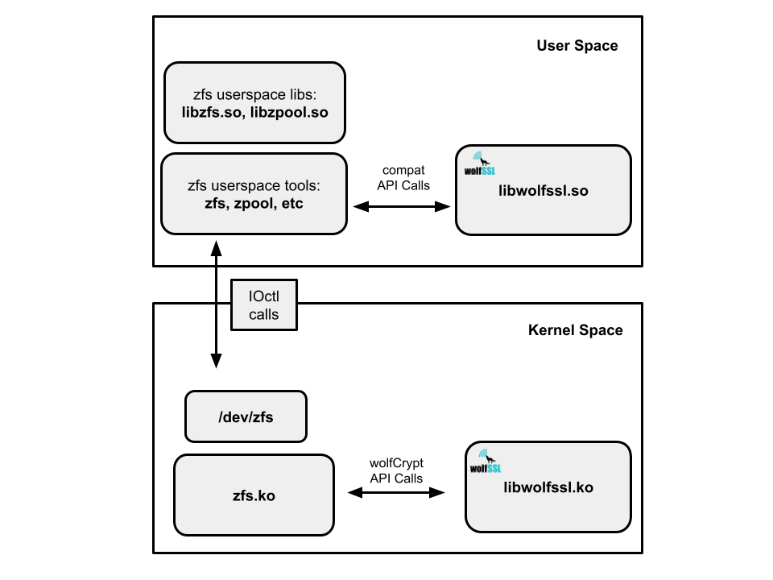

## Description

This project contains a patch for OpenZFS (https://github.com/openzfs/zfs)
that replaces its native crypto implementation (used on linux) with wolfCrypt
API calls. It links against `libwolfssl.so` and `libwolfssl.ko` in user and
kernel space.

The patch was written for this commit:
```
commit cd06f79e2949b6255f5e8bf621c1b9497ad97b02 (HEAD)
Author: Christos Longros <98426896+chrislongros@users.noreply.github.com>
Date:   Sun Apr 26 00:24:38 2026 +0200
```
This patch inserts only a modest line count for wolfCrypt API calls, while
removing zfs internal crypto implementations:
```
$ git diff --stat | tail -n1
 38 files changed, 821 insertions(+), 28583 deletions(-)
```



### License
The `ZFS_META_LICENSE` conflicts with the GPL-only libwolfssl.ko symbols
in a GPL build, causing modpost to fail. To resolve the conflict, either:
  1. obtain commercial licensing, or
  2. comment out the license, and use this for educational purposes only.

See:
- `module/os/linux/zfs/zfs_ioctl_os.c`

This project is a demonstration and not intended for production use as is.

## Prereq

This was done with Debian 13 netinst iso from here:
https://www.debian.org/CD/netinst/

The default install options were used for everything. You must set up a normal
user, and a root user. Root access is required to bootstrap sudoers access
later.

After install:
```
uname -a
Linux debian 6.12.43+deb13-amd64 #1 SMP PREEMPT_DYNAMIC Debian 6.12.43-1 (2025-08-27) x86_64 GNU/Linux
```

## Build kernel

This requires an extracted and built kernel source tree.

```
sudo apt update

sudo apt install \
  build-essential git dpkg-dev libncurses-dev \
  libssl-dev libelf-dev bison flex make clang \
  bc libudev-dev perl tar xz-utils dwarves gawk vim \
  uuid-dev autoconf automake libtool
```

1. Install linux source and headers
```
sudo apt install linux-source linux-headers-$(uname -r)
```

2. Extract to a local dir
```
cd ~
tar -xf /usr/src/linux-source-6.12.tar.xz
mv linux-source-6.12 kernelsrc
```

3. Configure kernel
```
cd ~/kernelsrc
cp /boot/config-$(uname -r) .config
```

4. Update EXTRAVERSION in Makefile:
```
EXTRAVERSION = -wolf
```

5. Now make config first
```
make olddefconfig
make scripts
make certs
```

6. Then build and install
```
make modules_prepare
make modules -j4
make -j4
sudo make modules_install
sudo make install
```

You should see the new kernel installed to:
- /boot/vmlinuz-6.12.43-wolf
- /boot/initrd.img-6.12.43-wolf
- /lib/modules/6.12.43-wolf/
- etc.

Now reboot into the newly installed kernel. After reboot you should see
```
uname -r
6.12.43-wolf
```

## Build libwolfssl

Patched ZFS will need to link to wolfssl both in userspace and kernelspace.

Before proceeding, update `kernel_src` in `scripts/wolfssl/build_wolfssl_ko`
to point to your extracted and built kernel source tree.

Clone wolfSSL:
```
git clone https://github.com/wolfSSL/wolfssl.git
```

1. Build `libwolfssl.so` userspace lib first:
```
./scripts/wolfssl/build_wolfssl_so
```

2. Build `libwolfssl.ko` kernel module:
```
./scripts/wolfssl/build_wolfssl_ko
```

You should see the libwolfssl module:
```
lsmod | grep wolf
libwolfssl           1056768  0
```

## Build wolfZFS (patched OpenZFS)

Before proceeding, update `wolf_src` in `scripts/zfs/build_wolfzfs`
to point to your wolfssl src tree.

1. First, clone ZFS:
```
git clone https://github.com/openzfs/zfs.git
```

2. Patch OpenZFS:
```
cd zfs
git co cd06f79e2
git apply ../patches/cd06f79e2_wolfzfs.patch
cd ../
```

3. Build wolfzfs (patched OpenZFS):
```
./scripts/zfs/build_wolfzfs
```

4. Run zfs crypto test (should pass in 5 s or less):
```
./scripts/test_zfs/run_crypto
```

Expected output:
```
[2026-03-21T03:01:43.050005] Test: /home/.../zfs/tests/zfs-tests/tests/functional/crypto/icp_aes_ccm (run as root) [00:00] [PASS]
[2026-03-21T03:01:43.138521] Test: /home/.../zfs/tests/zfs-tests/tests/functional/crypto/icp_aes_gcm (run as root) [00:00] [PASS]

Results Summary
PASS	   2

Running Time:	00:00:00
Percent passed:	100.0%
```

5. Next run zfs sanity test (could take 15-20 min):
```
./scripts/test_zfs/run_sanity
```

Expected output (not all tests will pass, it's environmental):
```
Results Summary
PASS	 821
FAIL	   9

Running Time:	00:20:42
Percent passed:	98.9%
Log directory:	/var/tmp/test_results/20260227T154831

Tests with results other than PASS that are expected:

Tests with result of PASS that are unexpected:

Tests with results other than PASS that are unexpected:
    FAIL acl/off/posixmode (expected PASS)
    FAIL cli_root/zfs_load-key/zfs_load-key_all (expected PASS)
    FAIL cli_root/zfs_load-key/zfs_load-key_https (expected PASS)
    FAIL cli_root/zfs_load-key/zfs_load-key_location (expected PASS)
    FAIL cli_root/zfs_load-key/zfs_load-key_recursive (expected PASS)
    FAIL cli_root/zfs_set/canmount_002_pos (expected PASS)
    FAIL cli_root/zpool_create/zpool_create_011_neg (expected PASS)
    FAIL pyzfs/pyzfs_unittest (expected PASS)
    FAIL xattr/xattr_003_neg (expected PASS)
```

You should see zfs loaded:
```
lsmod | grep zfs
zfs                  6754304  2
spl                   159744  1 zfs
libwolfssl           1019904  1 zfs
```

dmesg should show that ZFS is using libwolfssl

```
[ 1734.930029] info: zfs using libwolfssl
[ 1735.065616] ZFS: Loaded module v2.4.99-1, ZFS pool version 5000, ZFS filesystem version 5
```
